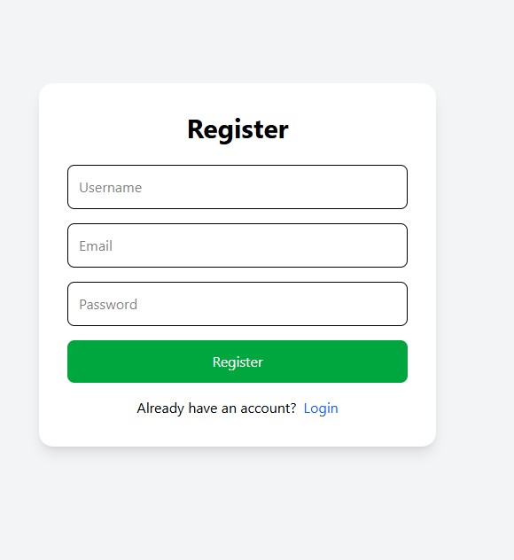
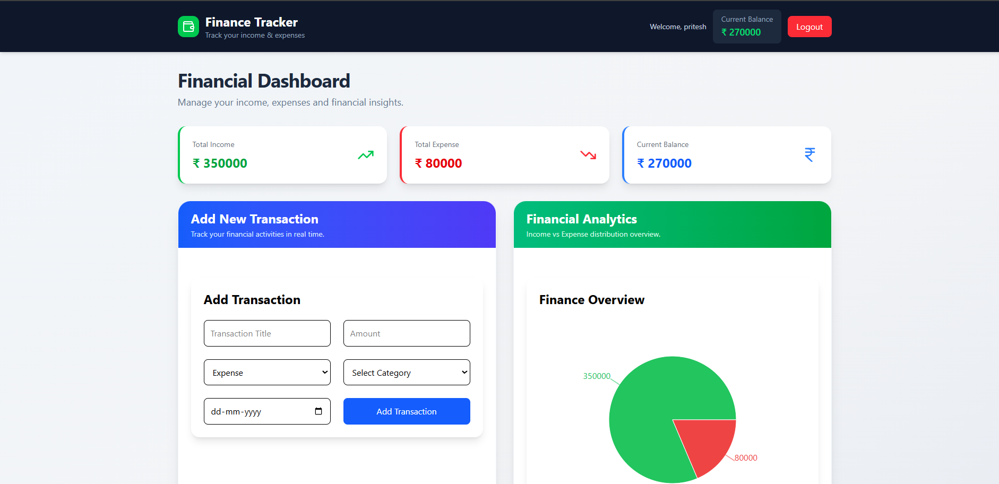
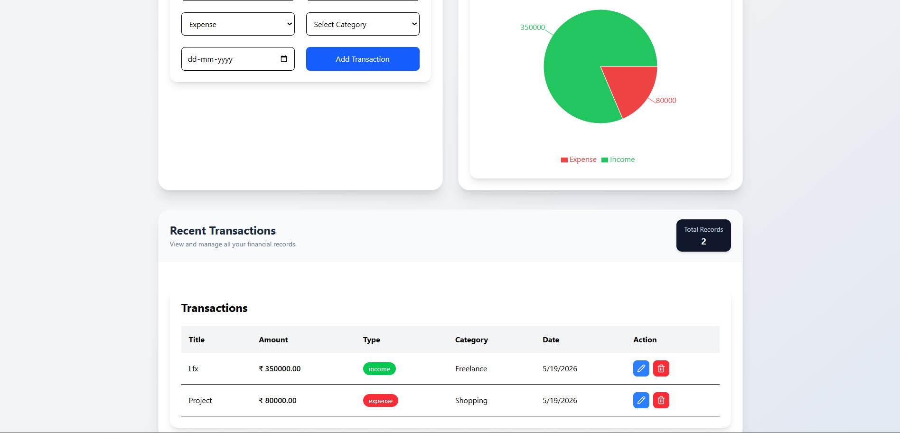
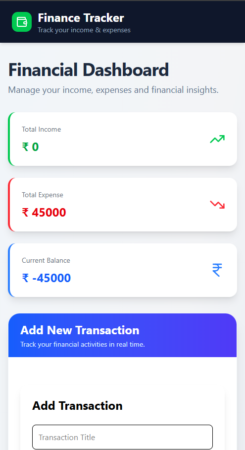
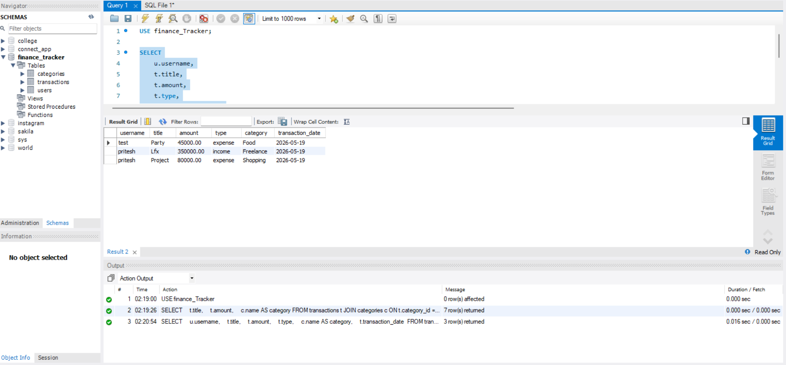

# 💰 Personal Finance Tracker

A full-stack and fully responsive Personal Finance Tracker application built using **React, Express.js, and MySQL** with **JWT Authentication** and **user-specific financial management**.

---

#  Features

##  Authentication
- User Registration
- User Login
- JWT-based Authentication
- Protected Routes
- Logout Functionality

# 📸 Screenshot

## Register Page



---

##  Transaction Management
- Add Transactions
- Update Transactions
- Delete Transactions
- View Transactions
- User-specific Financial Records

---

##  Analytics Dashboard
- Total Income
- Total Expense
- Current Balance
- Finance Overview Chart

# 📸 Screenshots

## Dashboard





---

##  Database Features
- MySQL Relational Database
- Primary Keys
- Foreign Keys
- SQL JOIN Queries
- Aggregate Functions

# 📸 Screenshot

## Database Page



---

#  Tech Stack

## Frontend
- React.js
- Tailwind CSS
- React Router DOM
- Axios
- Recharts
- Lucide React

---

## Backend
- Node.js
- Express.js
- JWT Authentication
- bcryptjs

---

## Database
- MySQL

---

#  Project Structure

```bash
Personal Finance Tracker/
│
├── Backend/
│   ├── Controllers/
│   ├── Database/
│   ├── Middleware/
│   ├── Routes/
│   ├── server.js
│   └── package.json
│
├── Frontend/
│   ├── src/
│   │   ├── Api/
│   │   ├── Components/
│   │   ├── Pages/
│   │   ├── App.jsx
│   │   └── main.jsx
│   └── package.json
│
└── README.md
```

---

#  Database Schema

## Users Table

| Column | Type |
|---|---|
| id | INT |
| username | VARCHAR |
| email | VARCHAR |
| password | VARCHAR |

---

## Categories Table

| Column | Type |
|---|---|
| id | INT |
| name | VARCHAR |
| type | VARCHAR |

---

## Transactions Table

| Column | Type |
|---|---|
| id | INT |
| title | VARCHAR |
| amount | DECIMAL |
| type | VARCHAR |
| category_id | INT |
| user_id | INT |
| transaction_date | DATE |

---

#  Database Relationships

- One User → Many Transactions
- One Category → Many Transactions
- Transaction belongs to User
- Transaction belongs to Category

---

#  API Endpoints

## Authentication Routes

### Register User
```http
POST /auth/register
```

### Login User
```http
POST /auth/login
```

---

## Transaction Routes

### Get Transactions
```http
GET /transactions
```

### Create Transaction
```http
POST /transactions
```

### Update Transaction
```http
PUT /transactions/:id
```

### Delete Transaction
```http
DELETE /transactions/:id
```

### Get Summary
```http
GET /transactions/summary
```

---

#  Authentication Flow

1. User Registers
2. User Logs In
3. JWT Token Generated
4. Token Stored in LocalStorage
5. Protected Routes Verified using Middleware
6. User-specific transactions fetched from database

---

#  Installation

## Clone Repository

```bash
git clone <your-repo-url>
```

---

# Backend Setup

```bash
cd Backend
npm install
npm run dev
```

Create `.env` file:

```env
PORT=5000

DB_HOST=localhost
DB_USER=root
DB_PASSWORD=your_password
DB_NAME=finance_tracker

JWT_SECRET=your_secret_key
```

---

# Frontend Setup

```bash
cd Frontend
npm install
npm run dev
```

---

#  Future Improvements

- Monthly Expense Filters
- Budget Planning
- Dark Mode
- Export Reports
- Mobile Optimization
- Profile Settings

---

#  Author

Developed by Martand Prakhar